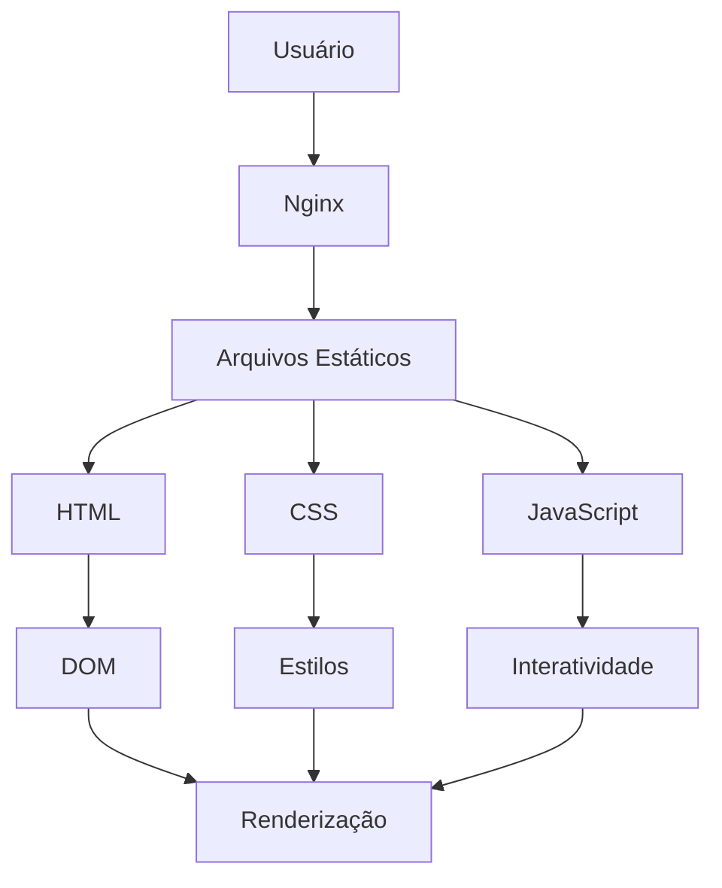

# 🏗️ Arquitetura do Projeto

## Visão Geral

Este projeto implementa uma arquitetura de **Single Page Applications (SPAs)** com **servidor web estático** otimizado para servir guias interativos de tecnologia.

## Estrutura de Diretórios

```
Resumos-e-Docs/
├── public/                          # 🎯 Ponto de entrada principal
│   ├── index.html                   # 🏠 Página inicial com navegação
│   ├── docker.html                  # 🐳 Guia Docker
│   ├── yaml.html                    # 📝 Guia YAML  
│   ├── svg.html                     # 🎨 Guia SVG
│   └── assets/                      # 📦 Recursos organizados
│       ├── css/                     # 🎨 Estilos modulares
│       ├── js/                       # ⚡ JavaScript separado
│       └── images/                  # 🖼️ Imagens e ícones
├── nginx.conf                       # ⚙️ Configuração otimizada
├── README.md                        # 📚 Documentação completa
└── .gitignore                       # 🚫 Controle de versão
```

## Princípios de Design

### 1. **Separação de Responsabilidades**
- **HTML:** Estrutura semântica e acessível
- **CSS:** Estilização modular por guia
- **JavaScript:** Lógica separada e reutilizável

### 2. **Mobile-First Design**
- Layout responsivo com sidebar fixa
- Animações suaves e interativas
- Performance otimizada para dispositivos móveis

### 3. **Modularidade**
- CSS organizado por módulos
- JavaScript separado por funcionalidade
- Fácil adição de novos guias

## Fluxo de Dados



## Configuração do Nginx

### Otimizações Implementadas
- ✅ **Compressão Gzip** para reduzir tamanho dos arquivos
- ✅ **Cache de arquivos estáticos** (1 ano para assets)
- ✅ **Headers de segurança** (XSS, CSRF, etc.)
- ✅ **Configuração de MIME types**
- ✅ **Logs estruturados**
- ✅ **Health check endpoint**

### Configurações de Cache
```nginx
# CSS e JS - Cache longo
location ~* \.(css|js)$ {
    expires 1y;
    add_header Cache-Control "public, immutable";
}

# Imagens - Cache longo
location ~* \.(jpg|jpeg|png|gif|ico|svg)$ {
    expires 1y;
    add_header Cache-Control "public, immutable";
}
```

## Performance

### Métricas Alvo
- **Lighthouse Score:** 95+ em todas as categorias
- **First Contentful Paint:** < 1.5s
- **Largest Contentful Paint:** < 2.5s
- **Cumulative Layout Shift:** < 0.1
- **Time to Interactive:** < 3s

### Otimizações
1. **Compressão Gzip** para reduzir transferência
2. **Cache de assets** para reduzir requisições
3. **Minificação** de CSS e JS (futuro)
4. **Lazy loading** de imagens (futuro)

## Segurança

### Headers Implementados
```nginx
add_header X-Frame-Options "SAMEORIGIN" always;
add_header X-Content-Type-Options "nosniff" always;
add_header X-XSS-Protection "1; mode=block" always;
add_header Referrer-Policy "no-referrer-when-downgrade" always;
add_header Content-Security-Policy "default-src 'self' http: https: data: blob: 'unsafe-inline'" always;
```

### Arquivos Bloqueados
- Arquivos de configuração (`.conf`, `.yml`, `.yaml`, `.json`)
- Arquivos de log (`.log`, `.sql`, `.bak`)
- Arquivos ocultos (começando com `.`)

## Escalabilidade

### Adicionando Novos Guias
1. Criar novo arquivo HTML em `public/`
2. Criar CSS específico em `public/assets/css/`
3. Criar JavaScript específico em `public/assets/js/`
4. Adicionar link na página inicial
5. Atualizar navegação

### Estrutura de um Novo Guia
```
public/
├── novo-guia.html          # Página principal
└── assets/
    ├── css/
    │   └── novo-guia.css    # Estilos específicos
    └── js/
        └── novo-guia.js     # Lógica específica
```

## Monitoramento

### Health Check
```bash
curl http://localhost/health
# Retorna: "healthy"
```

### Logs
- **Access Log:** `/var/log/nginx/access.log`
- **Error Log:** `/var/log/nginx/error.log`

## Futuras Melhorias

1. **Build Process:** Implementar Webpack/Vite
2. **TypeScript:** Migrar JavaScript para TypeScript
3. **PWA:** Transformar em Progressive Web App
4. **Analytics:** Implementar tracking de uso
5. **Search:** Adicionar funcionalidade de busca
6. **Dark Mode:** Implementar tema escuro
